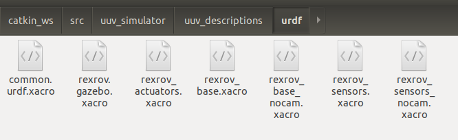

# ROS-Gazebo实现无人船海洋环境仿真

## 一. 项目介绍

需要的各模块版本简介：ubuntu18.04、ROS melodic、Gazebo9 。如果版本不对应可能会出现未知的错误。

- ROS melodic简体中文安装教程：http://wiki.ros.org/melodic/Installation/Ubuntu
- Gazebo安装教程：https://gazebosim.org/docs/latest/install
- UUV——simulator的github主页：https://github.com/uuvsimulator/uuv_simulator
- UUV官方教程主页：https://uuvsimulator.github.io/packages/uuv_simulator/intro/

本项目主要原理是由ROS提供仿真的底层计算，Gazebo实现仿真可视化，UUV—simulator为两者提供支持以实现海洋相关的仿真，为ROS提供插件和应用程序，为Gazebo提供海洋相关场景、无人系统的建模和其他模拟。

其中修改UUV Simulator这个模型来仿真自己的无人船环境。

首先安装VMware虚拟机，然后在ubuntu官网下载ubuntu18.04
然后安装适用于ubuntu18.04的ROS melodic（可以查找一键安装ROS各个版本的指令，安装十分方便）。
然后可以不安装Gazebo，直接按照UUV官方教程安装UUV-Simulator。也可自行安装适配于开源UUV-Simulator的gazebo版本。


目前经过石师哥还有杨睿老师的学生共同努力下已经完成了大部分内容。

首先是沿用UUV-Simulator这个仿真项目的控制底层逻辑，然后修改了其模型，还有螺旋桨。以此适合本项目无人船。

然后用python完成上层控制逻辑（如视觉伺服的nmpc控制）的运算，输出的是速度信号。该速度信号输出到四个螺旋桨上进而实现控制任务。

全项目目前的文字描述大致如此。


到了我手，目前发现**有几个问题需要改进**。

1. 由于船的物理模型等并不匹配，所以输出的是速度逻辑的运算。而实际无人船控制是输出的力与力矩。

   设想方案一：就是在python控制代码层面考虑进物理模型，或者考虑模型转化关系，虽然控制算法输出的是力与力矩，但通过单独的代码转换成相应的速度输出。进而适配了原有方案。

   设想方案二：修改螺旋桨的控制输入方式。并且修改原开源模型的物理特性。

2. 物理建模把摄像头安装在云台上，进而更加符合实验环境。

3. 通过几次测试发现浮体的碰撞体积有问题


## 二. ROS入门学习

推荐入门教程，古月居：
https://www.bilibili.com/video/BV1zt411G7Vn/?spm_id_from=333.337.search-card.all.click

### 2.1 基础操作

$ ros  然后按两下tab可以得到所有的ros操作
$ roscore  启动ros核心（其他操作的基础）
$ rosrun  运行某ros节点node
$ rqt_graph 绘制当前节点传输图

$ rosnode list 把系统中的所有节点列出 (rosout 为默认节点）

$ rosnode info [node如/turtlesim ] 获取某node收发信息
$ rostopic list 获取当前所有topic/话题名
$ rostopic pub 发布一个主题如

$rostopic pub -r 10  /turtle1/cmd_vel geometry_msgs/Twist "linear: 
 x: 1.0
 y: 2.0
 z: 1.1
angular:
 x: 0.0
 y: 0.0
 z: 0.0"

其中-r 10表示以10hz的频率循环该主题，后面的全部是指令内容，表示让海龟以某线速度和角速度来进行运动（初始的小海龟教程）

$ rosmsg show geometry_msgs/Twist 展示某数据结构（geometry_msgs/Twist）
$ rosservice list 展示所有可以提供的服务

$ rosservice call /spawn "x: 2
y: 2
theta: 2
name: 'turtle2'"

呼叫服务，这里是在某位置产生一个新的海龟

$ rosbag record -a -o cmd_record 话题记录 记录从此以后的所有话题数据

(此处是-a表示记录所有数据，-o表示保存为压缩包 cmd_record表示压缩包名称)ctrl+c结束记录，默认保存在home目录

$ rosbag play cmd_record.bag 复现前面保存的名为cmd_record.bag的数据

### 2.2 工作空间总结

#### 2.2.1什么是ROS的工作空间

工作空间也就是管理和组织ROS工程项目文件的地方。其下主要的一级目录有四个：

- src：源空间
- build：编译空间
- devel：开发空间
- install：安装空间

其中，

- 最顶层的工作空间（可以任意命名）和 src （必须为src）文件夹是需要自己创建；
- build 和 devel 文件夹由 catkin_make 命令自动创建；
- install 文件夹由 catkin_make install 命令自动创建。

> catkin 是 ROS 定制的编译构建系统，是对CMake的扩展，对ROS这样大体量的工程有更好的支持，同时也简化了操作。

**注意：使用 catkin_make 编译之前一定要回到最顶层的工作空间。**

具体文件关系如图所示：


##### 2.2.2.1 src：源空间

存放功能包（package）。

功能包是ROS文件系统中组织程序文件的基本单元，也就是catkin编译的基本单元。一个 package 下必须包含 CMakeLists.txt 和 package.xml 两个文件：

- CMakeLists.txt 文件中规定了功能包的编译规则，包括指定功能包名称，指定编译依赖项，指定要编译的源文件，指定要添加的消息格式文件/服务格式文件/动作格式文件，指定生成的消息/服务/动作，指定头文件搜索目录，指定链接库搜索目录，指定生成的静态链接库文件，指定需要链接的库文件，指定编译生成的可执行文件以及路径等等。
- package.xml 文件定义了功能包的属性信息，包括包名，版本号，作者，编译依赖和运行依赖等。

另外，

- include 和 src 分别存放头文件（*.h）和源程序文件（*.c/*.cpp等）；
- scripts 存放脚本文件（比如Python文件 *.py，shell文件 *.sh）；
- launch 存放 launch文件（*.launch），用于批量运行多个可执行文件；
- config 存放配置文件（*.yaml等）；

此外，还有自定义的通信格式文件，包括消息（*.msg）、服务（*.srv）以及动作（*.action）。

##### 2.2.2.2 build：编译空间

存放CMake和catkin的缓存信息、配置信息和其他中间文件。

##### 2.2.2.3 devel：开发空间

存放编译后生成的目标文件，包括头文件、动态&静态链接库、可执行文件等。

##### 2.2.2.4 install：安装空间

即开发完成后的安装包。

#### 2.2.2 创建工作空间

```bash
mkdir -p ~/catkin_ws/src        #使用系统命令创建工作空间目录
cd ~/catkin_ws/src
catkin_init_workspace           # ROS的工作空间初始化命令
```

创建完成后，在工作空间的根目录下使用`catkin_make`命令编译整个工作空间：

```bash
cd ~/catkin_ws                  # 回到工作空间的根目录
catkin_make                     # 编译整个工作空间
```

编译中，工作空间的根目录会自动产生`devel`和`build`两个文件夹即其中的文件。

编译完成后，在devel文件夹中已经产生几个`setuo.*sh`形式的环境变量设置脚本，使用`source`命令运行这些脚本，可以使工作空间中的环境变量生效。

```bash
source devel/setup.bash
```

检查环境变量是否生效：

```bash
echo $ROS_PACKAGE_PATH
```

如果打印的路径中包含当前工作空间中的路径，则说明环境变量设置成功。

> 注意：`source`命令设置的环境变量只能在当前终端生效，如果希望在所有终端生效，需要在终端配置文件中加入环境变量设置：`echo "source /home/xxx/catkin_ws/devel/setup.bash" >> ~/.bashrc`

#### 2.2.3 工作空间的覆盖

ROS允许多个工作空间并存，用户可在不同项目的工作空间创建所需要的功能包，但这样的话可能会遇到一种情况：不同的工作空间中可能存在同名的功能包，如果这些工作空间的环境变量已经设置，那么在使用该功能包的时候，ROS如何解决冲突？

答案就是 **ROS的工作空间覆盖机制（Overlaying）**。

所有工作空间的路径会依次在`ROS_PACKAGE_PATH`环境变量中记录，当设置多个工作空间的环境变量后，新设置的路径在`ROS_PACKAGE_PATH`中会自动放置在最前端，在运行时，ROS会优先查找在最前端的工作空间中是否存在指定的功能包，如果不存在就顺序向后查找其他工作空间，直到最后一个工作空间为止。

> 注意：如果除了`source /home/xxx/catkin_ws/devel/setup.bash`之外，还使用`export ROS_PACKAGE_PATH=${ROS_PACKAGE_PATH}: ~/ORB_SLAM/ORB_SLAM2/Examples/ROS`命令在`~/.bashrc`中固定了终端的环境变量，那么需要注意先后顺序，`~/.bashrc`文件中越靠下的路径在`ROS_PACKAGE_PATH`中越靠前。

查看所有ROS相关的环境变量命令：`env | grep ros`; 查看ROS_PACKAGE_PATH变量的值：`echo $ROS_PACKAGE_PATH`。

### 2.3 功能包

#### 2.3.1 功能包简介

功能包(package)是ROS中的基本单元，包含ROS节点、库、配置文件等。

一个功能包的典型文件结构如下：

config：功能包的配置文件，用户创建。
include：需要用到的头文件。
**scripts：可以直接运行的Python脚本。**
src：需要编译的C++代码。
launch：所有启动文件。
msg：自定义的消息类型。
srv：自定义的服务类型。
action：自定义的动作指令。
CMakeLists.txt：Catkin编译器编译功能包的规则。
package.xml： 功能包清单，可得到该package的名称、版本号、信息描述、作者信息和许可信息等。更重要的，<build_depend> ... </build_depend>标签定义了代码编译所依赖的其它功能包，<exec_depend> ... </exec_depend>标签定义了可执行程序运行时所依赖的其它功能包。
上面的这些文件夹并不是每一个都要有，根据需要创建即可，比如不需要运行python文件，就不用scripts文件夹。此外，也可以自定义其他的文件夹。


#### 2.3.2 创建功能包

ROS不允许功能包的嵌套，多个功能包必须平行放置在代码空间(src)中。
ROS直接创建功能包的命令catkin_create_pkg，用法：

catkin_create_pkg <package_name> [depend1] [depend2] [depend3]
即需要输入功能包名称和所依赖的其它功能包。

进入代码空间，创建功能包：

cd ~/catkin_ws/src
catkin_create_pkg leraning_communication std_msgs rospy roscpp
回到工作空间根目录进行编译，设置环境变量：

cd ~/catkin_ws
catkin_make
source ~/catkin_ws/devel/setup.bash
一个功能包就这样创建完成了。

#### 2.3.3 功能包常用操作指令

ROS针对功能包的常用命令如下：

```bash
catkin_create_pkg           # 创建功能包
catkin_make         # 编译工作空间中的功能包
rospack             # 获取功能包的信息
rosdep              # 自动安装功能包依赖的其它包
roscd               # 功能包目录跳转
roscp               # 拷贝功能包中的文件
rosed               # 编辑功能包中的文件
rosrun              # 运行功能包中的可执行文件
roslaunch           # 运行启动文件
```


### 2.4实践之Publisher编程实现

将如下代码文件放入 

结果： 该文件实现了发布一个消息给/turtle1/cmd_vel的功能
程序中将标记重要的第一次出现的语法
/***********************************************************************
Copyright 2020 GuYueHome (www.guyuehome.com).
***********************************************************************/

~~~c++
/** 该例程将发布turtle1/cmd_vel话题，消息类型geometry_msgs::Twist **/
#include <ros/ros.h>
#include <geometry_msgs/Twist.h>

int main(int argc, char **argv)
{
    // ROS节点初始化
    ros::init(argc, argv, "velocity_publisher");

// 创建节点句柄
ros::NodeHandle n;

// 创建一个Publisher，发布名为/turtle1/cmd_vel的topic，消息类型为geometry_msgs::Twist，队列长度10
ros::Publisher turtle_vel_pub = n.advertise<geometry_msgs::Twist>("/turtle1/cmd_vel", 10);

// 设置循环的频率
ros::Rate loop_rate(10);

int count = 0;
while (ros::ok())
{
    // 初始化geometry_msgs::Twist类型的消息
    geometry_msgs::Twist vel_msg;
    vel_msg.linear.x = 0.5;
    vel_msg.angular.z = 0.2;

    // 使用前面定义的publisher发布消息
    turtle_vel_pub.publish(vel_msg);
    ROS_INFO("Publsh turtle velocity command[%0.2f m/s, %0.2f rad/s]", 
            vel_msg.linear.x, vel_msg.angular.z);

    // 按照循环频率延时
    loop_rate.sleep();
}

return 0;

}
~~~

然后还要在 中的 中的Build位置处加入
add_executable(velocity_publisher src/velocity_publisher.cpp)
target_link_libraries(velocity_publisher ${catkin_LIBRARIES})
第一个表示添加一个需要编译的文件，第二个表示将可执行文件链接到库

我第二步不成功，选择使用了

```bash
$ catkin build
```

编译成功的
如果用python文件运行不需要编译直接：

```bash
$ rosrun xxx_topic xxxxxxxxxx.py
```


### 2.5实践之Subscriber实现

Publisher和subscriber之间的关系如图。
Publisher是向topic（某接口）发送消息从而得到某些效果，而subscriber是实时获取某topic中的信息。
Subcriber的具体实现与上面基本类似，源代码位于附件中。
/***********************************************************************
Copyright 2020 GuYueHome (www.guyuehome.com).
***********************************************************************/

```c++
/**

 * 该例程将订阅/turtle1/pose话题，消息类型turtlesim::Pose
   */

#include <ros/ros.h>
#include "turtlesim/Pose.h"

// 接收到订阅的消息后，会进入消息回调函数，回调函数指接听到来自topic或者service的消息后而行动的函数
void poseCallback(const turtlesim::Pose::ConstPtr& msg)
{
    // 将接收到的消息打印出来
    ROS_INFO("Turtle pose: x:%0.6f, y:%0.6f", msg->x, msg->y);
}

int main(int argc, char **argv)
{
    // 初始化ROS节点
    ros::init(argc, argv, "pose_subscriber");

    // 创建节点句柄
    ros::NodeHandle n;
    
    // 创建一个Subscriber，订阅名为/turtle1/pose的topic，注册回调函数poseCallback
    ros::Subscriber pose_sub = n.subscribe("/turtle1/pose", 10, poseCallback);
    
    // 循环等待回调函数
    ros::spin();
    
    return 0;

}
```


### 2.6实践之topic定义


剩下的细节按照视频来，注意：
1.	Roscore仅用来建立节点之间的联系，如果联系已经建立，roscore退出也不影响两者的联系，但后续的其他沟通是无法进行的
2.	编译时别忘了修改CMakelist

### 2.7实践之client实现

服务器模型，与前面的区别：服务为同步的，客户（client）向服务器（service）请求，服务器给客户发送。
使用见附件，与前面一致，代码如下
/***********************************************************************
Copyright 2020 GuYueHome (www.guyuehome.com).
***********************************************************************/

```c++
/**
该例程将请求/spawn服务，服务数据类型turtlesim::Spawn
*/

#include <ros/ros.h>
#include <turtlesim/Spawn.h>

int main(int argc, char** argv)
{
    // 初始化ROS节点
    ros::init(argc, argv, "turtle_spawn");

    // 创建节点句柄
    ros::NodeHandle node;
    
    // 发现/spawn服务后（如果没有发现就一直等待），创建一个服务客户端（add_turtle），连接名为/spawn的service
    ros::service::waitForService("/spawn");
    ros::ServiceClient add_turtle = node.serviceClient<turtlesim::Spawn>("/spawn");
    
    // 初始化turtlesim::Spawn的请求数据（构建要发送的消息）
    turtlesim::Spawn srv;
    srv.request.x = 2.0;
    srv.request.y = 2.0;
    srv.request.name = "turtle2";
    
    // 请求服务调用
    ROS_INFO("Call service to spwan turtle[x:%0.6f, y:%0.6f, name:%s]", 
             srv.request.x, srv.request.y, srv.request.name.c_str());
    
    add_turtle.call(srv); // 在客户add_turtle发送信息并且等待反馈，如果没有反馈，则一直等待
    
    // 显示服务调用结果
    ROS_INFO("Spwan turtle successfully [name:%s]", srv.response.name.c_str());
    
    return 0;

};
```

整体流程概括为：
创建节点——查找/spawn服务——建立客户Client（名为add_turtle），且指定该客户Client要请求的服务名为/spawn——创建Spawn请求数据——客户向服务/spawn请求服务——显示服务结果

### 2.8实践之server实现

/***********************************************************************
Copyright 2020 GuYueHome (www.guyuehome.com).
***********************************************************************/

```c++
/**

 * 该例程将执行/turtle_command服务，服务数据类型std_srvs/Trigger
   */

#include <ros/ros.h>
#include <geometry_msgs/Twist.h>
#include <std_srvs/Trigger.h>

ros::Publisher turtle_vel_pub;
bool pubCommand = false;

// service回调函数，输入参数req，输出参数res
bool commandCallback(std_srvs::Trigger::Request  &req,
                    std_srvs::Trigger::Response &res)
{
    pubCommand = !pubCommand;

    // 显示请求数据
    ROS_INFO("Publish turtle velocity command [%s]", pubCommand==true?"Yes":"No");
    
    // 设置反馈数据
    res.success = true;
    res.message = "Change turtle command state!"
    
    return true;

}

int main(int argc, char **argv)
{
    // ROS节点初始化
    ros::init(argc, argv, "turtle_command_server");

    // 创建节点句柄
    ros::NodeHandle n;
    
    // 创建一个名为/turtle_command的server，注册回调函数commandCallback
    ros::ServiceServer command_service = n.advertiseService("/turtle_command", commandCallback);
    
    // 创建一个Publisher，发布名为/turtle1/cmd_vel的topic，消息类型为geometry_msgs::Twist，队列长度10
    turtle_vel_pub = n.advertise<geometry_msgs::Twist>("/turtle1/cmd_vel", 10);
    
    // 循环等待回调函数
    ROS_INFO("Ready to receive turtle command.");
    
    // 设置循环的频率
    ros::Rate loop_rate(10);
    
    while(ros::ok())
    {
        // 查看一次回调函数队列
        ros::spinOnce();
        
        // 如果标志为true，则发布速度指令
        if(pubCommand)
        {
            geometry_msgs::Twist vel_msg;
            vel_msg.linear.x = 0.5;
            vel_msg.angular.z = 0.2;
            turtle_vel_pub.publish(vel_msg);
        }
    
        //按照循环频率延时
        loop_rate.sleep();
    }
    
    return 0;

}
```

该程序原理：
创建节点——创建一个服务器server（名为command_service，这里其实应该是server，因为类型为ServiceServer），其提供的服务名为/turtle_command，其回调函数名为commandCallback（）——创建一个publisher用于后续发布消息——进入循环（查看一次回调函数，如果被呼叫服务，则服务器给出一个回调操作，即改变pubCommand状态，然后判断pubCommand状态，如果为真，则通过前面的publisher来发布速度控制）

### 2.9实践之完整服务搭建（包括服务数据）

该模型简单说就是客户（client）person_client请求服务（service）/show_person ，然后服务向服务器（server）person_server请求数据，然后服务器向服务反馈数据person，然后服务向客户反馈数据person。总之就是客户通过请求服务来让服务器给发送数据，服务为客户和服务器之间的中介。
首先定义一个服务的数据结构
 “---”以上为request数据，下面为response  
代码直接看附件
代码原理如下：
Client端：创建节点——寻找/show_person服务——找到后创建客户person_client，并连接该服务——创建person请求数据——以person请求数据呼叫服务
Server端：创建节点——创建server并注册与服务/show_person相关的回调函数personcallback——不断循环等待回调函数——当收到来自服务/show_person的请求时，进行反馈

### 2.10实践之参数的使用

ROS Master全局参数服务器Parameter Server，所有其他节点都可以直接获取操作；

创建功能包

参数的基础操作
将附件中整个learning_parameter文件夹，复制到catkin_ws/src中，找到parameter_config.cpp，原理直接看源代码就行
/***********************************************************************
Copyright 2020 GuYueHome (www.guyuehome.com).
***********************************************************************/

```c++
/**

 * 该例程设置/读取海龟例程中的参数
   */
     #include <string>
     #include <ros/ros.h>
     #include <std_srvs/Empty.h>

int main(int argc, char **argv)
{
    int red, green, blue;

    // ROS节点初始化
    ros::init(argc, argv, "parameter_config");
    
    // 创建节点句柄
    ros::NodeHandle node;
    
    // 读取背景颜色参数
    ros::param::get("/background_r", red);
    ros::param::get("/background_g", green);
    ros::param::get("/background_b", blue);
    
    ROS_INFO("Get Backgroud Color[%d, %d, %d]", red, green, blue);
    
    // 设置背景颜色参数
    ros::param::set("/background_r", 255);
    ros::param::set("/background_g", 255);
    ros::param::set("/background_b", 255);
    
    ROS_INFO("Set Backgroud Color[255, 255, 255]");
    
    // 读取背景颜色参数
    ros::param::get("/background_r", red);
    ros::param::get("/background_g", green);
    ros::param::get("/background_b", blue);
    
    ROS_INFO("Re-get Backgroud Color[%d, %d, %d]", red, green, blue);
    
    // 调用服务，刷新背景颜色
    ros::service::waitForService("/clear");
    ros::ServiceClient clear_background = node.serviceClient<std_srvs::Empty>("/clear");
    std_srvs::Empty srv;
    clear_background.call(srv);
    
    sleep(1);
    
    return 0;

}
```


### 2.11实践之坐标变换tf


主要是惯性坐标系，各个体坐标系之间的位姿变换

前三行，实现了2号乌龟跟随1号乌龟，然后键盘控制1号乌龟同样可以被2号乌龟跟随
第4行是一个坐标系显示树，很重要的功能，下图为生成的文件（产生在用户根目录下）

$  rosrun tf tf_echo turtle1 turtle2
 该命令是显示当前两个体坐标系之间的信息，如下图，Translation是坐标差距，Rotation是转角差（四元数、弧度、角度三种描述方式）

rosrun rviz rviz -d `rospack find turtle_tf`/rviz/turtle_rviz.rviz
该命令是使用rviz进行可视化

### 2.12实践之坐标系广播broadcast与监听listener的编程实现


广播器实现：
/***********************************************************************
Copyright 2020 GuYueHome (www.guyuehome.com).
***********************************************************************/

```cpp
/**
该例程产生tf数据，并计算、发布turtle2的速度指令
**/

#include <ros/ros.h>
#include <tf/transform_broadcaster.h>
#include <turtlesim/Pose.h>

std::string turtle_name;

void poseCallback(const turtlesim::PoseConstPtr& msg)
{
    // 创建tf的广播器
    static tf::TransformBroadcaster br;

    // 初始化tf数据
    tf::Transform transform;
    transform.setOrigin( tf::Vector3(msg->x, msg->y, 0.0) );
    tf::Quaternion q;
    q.setRPY(0, 0, msg->theta);
    transform.setRotation(q);
    
    // 广播world与海龟坐标系之间的tf数据
    br.sendTransform(tf::StampedTransform(transform, ros::Time::now(), "world", turtle_name));
  }

int main(int argc, char** argv)
{
    // 初始化ROS节点
    ros::init(argc, argv, "my_tf_broadcaster");

    // 输入参数作为海龟的名字
    if (argc != 2)
    {
        ROS_ERROR("need turtle name as argument"); 
        return -1;
    }
    
    turtle_name = argv[1];
    
    // 订阅海龟的位姿话题
    ros::NodeHandle node;
    ros::Subscriber sub = node.subscribe(turtle_name+"/pose", 10, &poseCallback);
    
    // 循环等待回调函数
    ros::spin();
    
    return 0;

};
```

流程：创建节点——创建订阅者（订阅pose话题，指定回调函数）——等待回调——进入回调函数——创建tf广播器——构建tf广播数据（平移和旋转）——发送tf广播数据

创建监听器

```cpp
/**
该例程监听tf数据，并计算、发布turtle2的速度指令
**/

#include <ros/ros.h>
#include <tf/transform_listener.h>
#include <geometry_msgs/Twist.h>
#include <turtlesim/Spawn.h>

int main(int argc, char** argv)
{
    // 初始化ROS节点
    ros::init(argc, argv, "my_tf_listener");

    // 创建节点句柄
    ros::NodeHandle node;
    
    // 请求产生turtle2
    ros::service::waitForService("/spawn");
    ros::ServiceClient add_turtle = node.serviceClient<turtlesim::Spawn>("/spawn");
    turtlesim::Spawn srv;
    add_turtle.call(srv);
    
    // 创建发布turtle2速度控制指令的发布者
    ros::Publisher turtle_vel = node.advertise<geometry_msgs::Twist>("/turtle2/cmd_vel", 10);
    
    // 创建tf的监听器
    tf::TransformListener listener;
    
    ros::Rate rate(10.0);
    while (node.ok())
    {
        // 获取turtle1与turtle2坐标系之间的tf数据
        tf::StampedTransform transform;
        try
        {
            listener.waitForTransform("/turtle2", "/turtle1", ros::Time(0), ros::Duration(3.0));
            listener.lookupTransform("/turtle2", "/turtle1", ros::Time(0), transform);
        }
        catch (tf::TransformException &ex) 
        {
            ROS_ERROR("%s",ex.what());
            ros::Duration(1.0).sleep();
            continue;
        }
    
        // 根据turtle1与turtle2坐标系之间的位置关系，发布turtle2的速度控制指令
        geometry_msgs::Twist vel_msg;
        vel_msg.angular.z = 4.0 * atan2(transform.getOrigin().y(),
                                        transform.getOrigin().x());
        vel_msg.linear.x = 0.5 * sqrt(pow(transform.getOrigin().x(), 2) +
                                      pow(transform.getOrigin().y(), 2));
        turtle_vel.publish(vel_msg);
    
        rate.sleep();
    }
    return 0;

};
```

```cmd
cd -/catkin_ws
catkin_make
source devel/setup.bash
roscore
rosrun turtlesim turtlesim_node
rosrun learning_tf turtle_tf_broadcaster __name:=turtle1_tf_broadcaster /turtle1
rosrun learning_tf turtle_tf_broadcaster __name:=turtle2_tf_broadcaster /turtle2
rosrun learning_tf turtle_tf_listener
rosrun turtlesim turtle teleop_key
```


### 2.13实践之Launch文件

Launch文件是直接启动一系列节点、功能等的文件，只需要设定好launch文件，可以直接启动一个较为完整的仿真程序。

Name是为节点重新命名

#### 2.13.1 rosrun 与 roslaunch

rosrun 启动单个节点

```bash
rosrun package_name executable_file_name
```

roslaunch 是一个用于同时启动多个ros节点的命令行工具：

```bash
roslaunch package_name  launch_file_name
```

launch 文件是实现多个节点配置和启动的 XML 文件。根据规范，这些文件的后缀都是.launch 。通常会在packages 的 src 文件中创建一个 launch 文件夹，用于存放.launch文件。

一个最简单的launch文件可以像下面这样：

```xml
<launch>
    <node name="demo1" pkg="demo_package" type="demo_pub" output="screen"/>
    <node name="demo2" pkg="demo_package" type="demo_sub" output="screen"/>
</launch>
```

roslaunch 启动节点时，如果没有 ros Master 节点，则 roslaunch 会自动创建一个。

#### 2.13.2 roslaunch 的标签


**节点 <node>**
node标签是launch文件里最常见的标签，用于启动节点。节点常用属性如下：

| 属性                             | 作用                                                         |
| -------------------------------- | ------------------------------------------------------------ |
| pkg=“package_name”               | 节点所在的包名                                               |
| type=“file_name”                 | 可执行文件的名称，如果是用Python文件就写xxx.py，如果是cpp就写编译生成的可执行文件名 |
| name=“node_name”                 | 为节点指派名称，这将会覆盖掉ros::init()定义的node_name       |
| output=“screen”                  | 终端输出转储在当前的控制台上，而不是在日志文件中，这是一个调试期间常用的方法 |
| respawn=“true”                   | 当roslaunch启动完所有该启动的节点之后，会监测每一个节点，保证它们正常的运行状态。当它终止时，roslaunch 会将该节点重启 |
| required=“true”                  | 当被此属性标记的节点终止时，roslaunch会将其他的节点一并终止。注意此属性不可以与respawn="true"一起描述同一个节点 |
| ns = “NAME_SPACE”                | 在自定义的命名空间里运行节点，避免命名空间冲突               |
| launch-prefix = “command-prefix” |                                                              |


**命名、命名空间**

正如文件系统、网络URI和其他无数领域一样，ros 中的节点、消息流、参数等的命名都必须是唯一的。
机器人系统中常常包含相同的硬件或者软件子系统来简化工程量，如相同的机械臂、相机或轮子。为避免命名冲突，ros提供了两种机制来处理这些情况：命名空间和重映射。

命名空间是计算机科学的基本概念，ros采用/来分隔命名空间。正如两个同名文件可以存在于不同的文件路径中，ros可以在不同的命名空间中启动同一节点来避免命名冲突。


**嵌套 <include>**
导入另一个launch文件到当前文件。

```xml
<include file="$(find demo)/launch/demo.launch" ns="demo_namespace"/>
```

| 属性                                       | 作用                           |
| ------------------------------------------ | ------------------------------ |
| file ="$(find pkg-name)/path/filename.xml" | 想要导入的文件路径             |
| ns=“NAME_SPACE”                            | 相对NAME_SPACE命名空间导入文件 |


**重映射 <remap>**
将 ros 计算图中的资源进行重命名。
重映射，ROS支持topic的重映射，remap 有两个标签 ：`from ="original-name"` 和 `to="new-name"` ，即原名称和新名称。 注意：重映射之后原名称就没有了。
比如现在你拿到的节点订阅了`"/chatter"` topic，然而你自己写的节点只能发布到`"/demo/chatter" topic`，如何让你拿到的节点订阅自己发布的`"/demo/chatter"` topic呢？在 launch 文件中这样写：

```xml
<remap from="chatter" to="demo/chatter"/>
```

这样就可以直接把`”/chatter“` topic重映射到`”/demo/chatter“`, 不用修改任何代码，就可以让两个节点进行通讯了。 当然要确保这两个 topic 的消息类型是一致的。
如果这个 remap 标签写在与 node 元素的同一级，而且在 launch 元素内的最顶层。 那么这个重映射将会作用于 launch 文件中所有的节点。


**参数服务器中的参数 <param>和 <rosparam>**
param 标签的作用相当于命令行中的 rosparam set，用于设置 ros 运行中的参数，存储在参数服务器中。比如现在在参数服务器中添加一个名为 demo_param，值为 666 的参数：

```XML
<param name="demo_param" type="int" value="666"/>
```

rosparam 标签允许从 YAML 文件中一次性导入大量参数。
使用起来就像这样，其效果等于终端指令： `rosparam load file_name`

```XML
<rosparam command="load" file="$(find pkg-name)/path/name.yaml"/>
```

$(find pkg-name) 语句会先找到pkg-name功能包，然后在功能包中定位到 path/name.yaml 文件。


**launch 文件里的参数 <arg>**
arg 标签可以灵活的配置launch文件的参数值。用以创建可重用和可配置的launch文件。

向<arg> 参数传递值的方法有三种：命令行指令、通过<include>传参、在更高层的文件中声明。args不是全局的。 arg声明特定于单个launch文件，类似于方法中的局部参数。 您必须像在方法调用中一样，将arg值显式传递给include文件。

在 demo.launch 文件中声明一个参数，名叫 arg_demo，并给他赋值 666。参数只有在赋值之后才能够发挥作用。

```XML
<arg name="arg_demo" default="666"/>
<arg name="arg_demo_1" value="666"/>
```

以上是两种简单的赋值方法，两者的区别是使用 default 赋值的参数可以在命令行中像下面这样被修改，value 则不行。

命令行传参：

```BASH
roslaunch demo demo.launch arg_demo:=777
```

在 launch 文件中可以采用$(arg arg_name) 的形式调用参数值。如向<include>文件传参：

my_file.launch:

```XML
<include file="included.launch">
  <!-- all vars that included.launch requires must be set -->
  <arg name="hoge" value="fuga" />
</include>
```

included.launch:

```XML
<launch>
  <!-- declare arg to be passed in -->
  <arg name="hoge" /> 
  <!-- read value of arg -->
  <param name="param" value="$(arg hoge)"/>
</launch>
```

arg 和 param 在ROS里有根本性的区别，arg 不储存在参数服务器中，不能提供给节点使用，只能在launch文件中使用。param则是储存在参数服务器中，可以被节点使用。


**<group>标签**

通过以下例子说明group标签的作用。

```cpp
std::string topicName;
n.param<std::string>("topic_name", topicName, "message");
ros::Publisher chatter_pub = n.advertise<std_msgs::String>(topicName, 100);
```

很简单的一个publisher，向默认名称为message的Topic发消息。如果以默认参数运行，发布的Topic名称为 /message。

接下来，是本节要重点介绍的group标签。在launch文件中，通过设置group的ns属性，可以使group内部包含的param或node，通通添加独立的命名空间。launch示例：

```xml
<launch>
    <group ns="A">
        <param name="topic_name" value="message"/>
        <node name="publisher" pkg="launch_file_tutorial" type="launch_publisher" output="screen"/>
    </group>
    
    <group ns="B">
        <param name="topic_name" value="message"/>
        <node name="publisher" pkg="launch_file_tutorial" type="launch_publisher" output="screen"/>
    </group>
</launch>
```

我们保持topic_name的值和node的name完全一致，分别添加不同的group, A和B，运行结果如下：

```bash
$ roslaunch launch_file_tutorial multi_publisher.launch 

SUMMARY
========

PARAMETERS
 * /A/topic_name: message
 * /B/topic_name: message
 * /rosdistro: melodic
 * /rosversion: 1.14.10

NODES
  /A/
    publisher (launch_file_tutorial/launch_publisher)
  /B/
    publisher (launch_file_tutorial/launch_publisher)

process[A/publisher-2]: started with pid [26105]
[ INFO] [1621310742.998574500]: /A/message 0
process[B/publisher-3]: started with pid [26111]
[ INFO] [1621310743.083010200]: /B/message 0
[ INFO] [1621310743.498809400]: /A/message 1
[ INFO] [1621310743.583454900]: /B/message 1
[ INFO] [1621310743.998799000]: /A/message 2
[ INFO] [1621310744.083290500]: /B/message 2
```

适当删除了不必要的信息后，可以清楚地看到，parameters和nodes中添加了两个命名空间，使我们在不改动publisher的情况下，可同时运行两个节点，并往不同的Topic中发送消息。当时这不是唯一的作法（配置不同参数，更改不同的node name），却是比较好的作法，读者日后可在实践中多加体会。

### 2.14Qt工具箱

rqt_console 显示日志，如报错
rqt_plot 数据绘图，指定某参数，可以直接获取数据的变化趋势
rqt_image_view 插入摄像头后可以获取摄像头图像
rqt_graph 获取节点通讯图
rqt 获取所有的rqt功能，可以整合，作为上位机使用

### 2.15Rviz

可以二次开发

### 2.16资源整理

 

 

### 2.17总结

ROS是一个管理器，管理众多机器人相关的程序，让他们得以交流和共同协作。
通过ROS可以实现：数据的传输、保存、可视化，从而将数学层面的机器人描述变为直观的、模拟实际环境下的机器人运行实例。
在学习了ROS后，可以想象，一个大体的ROS环境下浮体仿真流程与硬件在环/软件在环仿真可以通过如下方式进行。
将设计的控制器（c++/python）/飞控软件/运行中的飞控硬件，连接至一个在ubuntu系统中设定好的node节点，该节点进行全部的数据收发、服务订阅，与Gazebo仿真环境中搭建的浮体模型进行交互。


launch文件是xml语言

.uedf是xml语言


## 3 ROS建模与环境教程

教程，古月居的付费课程，手打URDF建模文件

### 3.1URDF文件的编写与查看


可以直接在附件中找handwriting_urdf文件夹，里面有


拷贝编译后：

```bash
roslaunch mbot_description  display_mbot_urdf.launch
```

此处会出错，其实是没有安装一个插件：joint-state-publisher-gui，运行如下代码即可：

```bash
sudo apt-get install ros-melodic-joint-state-publisher-gui
```

总体原理为，在该package中的urdf文件夹建立可以完整描述模型的文件mbot.urdf，具体规则按照视频中来（在3.3节讲解）；

然后使用如下launch文件（display_mbot_urdf.launch）启动它

```xml
<launch>
	<!-- 设置机器人模型路径参数 -->
	<param name="robot_description" textfile="$(find mbot_description)/urdf/mbot.urdf" />

	<!-- 运行joint_state_publisher节点，发布机器人的关节状态  -->
	<node name="joint_state_publisher_gui" pkg="joint_state_publisher_gui" type="joint_state_publisher_gui" />
	
	<!-- 运行robot_state_publisher节点，发布tf  -->
	<node name="robot_state_publisher" pkg="robot_state_publisher" type="robot_state_publisher" />
	
	<!-- 运行rviz可视化界面 -->
	<node name="rviz" pkg="rviz" type="rviz" args="-d $(find mbot_description)/config/mbot_urdf.rviz" required="true" />

</launch>
```

Launch文件原理如注释所示。
运行实际效果图如下：


左下角的add可以添加tf视图，可通过勾选选择实际看到的东西。


### 3.2检查URDF模型整体结构


需提前安装：

```bash
$ sudo apt install liburdfdom-tools
```

图中命令会在当前目录生成如下结构图：


其中，base_link是模型基座，前后caster_link是加的支撑点，左右wheel是轮子，通过各个joint和一定的位移和转角进行了连接。

### 3.3 mbot.urdf文件解释

```xml
<!-- /////////////////////    COLOR  //////////////////////////// -->
<!-- 这一部分定义了许多颜色，后面直接引用颜色名即可不需要重新设定RGB -->

    <material name="Black">
        <color rgba="0 0 0 1"/>
    </material>
    <material name="White">
        <color rgba="1 1 1 0.95"/>
    </material>
    <material name="Blue">
        <color rgba="0 0 1 1"/>
    </material>
    <material name="Yellow">
        <color rgba="1 0.4 0 1"/>
    </material>

<!-- /////////////////////////    BASE    //////////////////////////////// -->
<!-- 这一部分是底座，origin表示设定模型体坐标系相对于模型体心的位姿：[0 0 0 0 0 0]，圆柱体长0.16. 半径0.2，颜色黄 -->

    <link name="base_link">
        <!--可视化内容-->
        <visual> 
            <origin xyz=" 0 0 0" rpy="0 0 0" />
            <geometry>
                <cylinder length="0.16" radius="0.20"/>
            </geometry>
            <material name="Yellow"/>
        </visual>
    </link>

<!-- //////////////////////    WHEEL    ///////////////////////////////// -->
<!-- 轮子，其他相同 -->

    <link name="left_wheel_link">
        <visual>
            <origin xyz="0 0 0" rpy="1.5707 0 0" />
            <geometry>
                <cylinder radius="0.06" length = "0.025"/>
            </geometry>
            <material name="White"/>
        </visual>
    </link>
<!-- 轮子关节，需要定义关节的类型（continous）位姿([0 0.19 -0.05 0 0 0])，母连接parent link，子连接child link，前面的位姿是指从母连接到子连接的位姿变化，旋转轴（y） -->

    <joint name="left_wheel_joint" type="continuous">
        <origin xyz="0 0.19 -0.05" rpy="0 0 0"/>
        <parent link="base_link"/>
        <child link="left_wheel_link"/>
        <axis xyz="0 1 0"/>
    </joint>
<!--另外一个轮子-->
    <link name="right_wheel_link">
        <visual>
            <origin xyz="0 0 0" rpy="1.5707 0 0" />
            <geometry>
                <cylinder radius="0.06" length = "0.025"/>
            </geometry>
            <material name="White"/>
        </visual>
    </link>
    
    <joint name="right_wheel_joint" type="continuous">
        <origin xyz="0 -0.19 -0.05" rpy="0 0 0"/>
        <parent link="base_link"/>
        <child link="right_wheel_link"/>
        <axis xyz="0 1 0"/>
    </joint>

<!-- ///////////////////////////    CASTER    ////////////////////////////////// -->
<!--//前后支撑球，形状球形，半径0.015，黑色//-->


    <link name="front_caster_link">
        <visual>
            <origin xyz="0 0 0" rpy="0 0 0"/>
            <geometry>
                <sphere radius="0.015" />
            </geometry>
            <material name="Black"/>
        </visual>
    </link>
<!-- 关节类型fixed（固定），位姿（[0.18 0 -0.095 0 0 0]）母连接 子连接 -->
    <joint name="front_caster_joint" type="fixed">
        <origin xyz="0.18 0 -0.095" rpy="0 0 0"/>
        <parent link="base_link"/>
        <child link="front_caster_link"/>
    </joint>

    <link name="back_caster_link">
        <visual>
            <origin xyz="0 0 0" rpy="0 0 0"/>
            <geometry>
                <sphere radius="0.015" />
            </geometry>
            <material name="Black"/>
        </visual>
    </link>
    
    <joint name="back_caster_joint" type="fixed">
        <origin xyz="-0.18 0 -0.095" rpy="0 0 0"/>
        <parent link="base_link"/>
        <child link="back_caster_link"/>
    </joint>

</robot>
```


### 3.4 机械臂例子的URDF文件编写

```xml
<!-- ////////////////////////////    colar    /////////////////// -->
	<material name="Black">
		<color rgba="0 0 0 1"/>
	</material>
	<material name="White">
		<color rgba="1 1 1 1"/>
	</material>
	<material name="Blue">
		<color rgba="0 0 1 1"/>
	</material>
	<material name="Red">
		<color rgba="1 0 0 1"/>
	</material>

<!-- ///////////////////////    BASE    //////////////////////////// -->
	<link name="base_link">
		<visual>
			<origin rpy="0 0 0" xyz="0 0 0"/>
			<geometry>
				<cylinder length="0.04" radius="0.05"/>
			</geometry>
			<material name="White"/>
		</visual>
	</link>

<!-- ///////////////////////////   LINK1  /////////////////////////////// -->
	<link name="link1">
		<visual>
			<origin rpy="0 1.5707 0" xyz="-0.05 0 0"/>
			<geometry>
				<cylinder length="0.1" radius="0.03"/>
			</geometry>
			<material name="Blue"/>
		</visual>
	</link>

	<joint name="joint1" type="revolute">
		<parent link="base_link"/>
		<child link="link1"/>
		<origin rpy="0 1.5707 0" xyz="0 0 0.02"/>
		<axis xyz="-1 0 0"/>
		<limit effort="300" lower="-3.14159" upper="3.14159" velocity="1"/>
	</joint>

<!-- //////////////////////   LINK2  //////////////////////////////// -->
	<link name="link2">
		<visual>
			<origin rpy="0 0 0" xyz="0 0 0.07"/>
			<geometry>
				<cylinder length="0.14" radius="0.03"/>
			</geometry>
			<material name="White"/>
		</visual>
	</link>

	<joint name="joint2" type="revolute">
		<parent link="link1"/>
		<child link="link2"/>
		<origin rpy="-1.5707 0 1.5707" xyz="-0.1 0 0.0"/>
		<axis xyz="1 0 0"/>
		<limit effort="300" lower="-3.14159" upper="3.14159" velocity="1"/>
	</joint>

<!-- //////////////////////   LINK3  /////////////////////////// -->
	<link name="link3">
		<visual>
			<origin rpy="0 0 0" xyz="0 0 -0.075"/>
			<geometry>
				<cylinder length="0.15" radius="0.03"/>
			</geometry>
			<material name="Blue"/>
		</visual>
	</link>

	<joint name="joint3" type="revolute">
		<parent link="link2"/>
		<child link="link3"/>
		<origin rpy="0 3.14159 0" xyz="0 0 0.14"/>
		<axis xyz="-1 0 0"/>
		<limit effort="300" lower="-3.14159" upper="3.14159" velocity="1"/>
	</joint>

<!-- //////////////////////   LINK4  ///////////////////////////////// -->
	<link name="link4">
		<visual>
			<origin rpy="0 1.5707 0" xyz="0.03 0 0"/>
			<geometry>
				<cylinder length="0.06" radius="0.025"/>
			</geometry>
			<material name="Black"/>
		</visual>
	</link>

	<joint name="joint4" type="revolute">
		<parent link="link3"/>
		<child link="link4"/>
		<origin rpy="0 1.5707 3.14159" xyz="0.0 0.0 -0.15"/>
		<axis xyz="1 0 0"/>
		<limit effort="300" lower="-3.14159" upper="3.14159" velocity="1"/>
	</joint>

<!-- ////////////////////////   LINK5  //////////////////////////////// -->
	<link name="link5">
		<visual>
			<origin rpy="0 0 0" xyz="0 0 0.03"/>
			<geometry>
				<cylinder length="0.06" radius="0.03"/>
			</geometry>
			<material name="White"/>
		</visual>
	</link>

	<joint name="joint5" type="revolute">
		<parent link="link4"/>
		<child link="link5"/>
		<origin rpy="0 1.5707 0" xyz="0.06 0.0 0.0"/>
		<axis xyz="1 0 0"/>
		<limit effort="300" lower="-3.14159" upper="3.14159" velocity="1"/>
	</joint>

<!-- /////////////////////   LINK6  //////////////////////////////// -->
	<link name="link6">
		<visual>
			<origin rpy="0 1.5707 0" xyz="0.01 0 0 "/>
			<geometry>
				<cylinder length="0.02" radius="0.04"/>
			</geometry>
			<material name="Blue"/>
		</visual>
	</link>

	<joint name="joint6" type="revolute">
		<parent link="link5"/>
		<child link="link6"/>
		<origin rpy="4.712385 -1.5707 0" xyz="0 0 0.06"/>
		<axis xyz="1 0 0"/>
		<limit effort="300" lower="-6.28318" upper="6.28318" velocity="1"/>
	</joint>

<!-- //////////////////////////   GRIPPER   //////////////////////////////// -->
	<link name="gripper_finger_link1">
		<visual>
			<origin rpy="0 1.5707 0" xyz="0.03 0 0"/>
			<geometry> <!--长方体，长宽高 -->
				<box size="0.03 0.01 0.06"/>
			</geometry>
			<material name="White"/>
		</visual>
	</link>

<link name="gripper_finger_link2">
	<visual>
		<origin rpy="0 1.5707 0" xyz="0.03 0 0"/>
		<geometry>
			<box size="0.03 0.01 0.06"/>
		</geometry>
		<material name="White"/>
	</visual>
</link>
<!--平移关节 -->
<joint name="finger_joint1" type="prismatic">
	<parent link="link6"/>
	<child link="gripper_finger_link1"/>
	<origin rpy="0 0 0" xyz="0.02 -0.03 0"/>
	<axis xyz="0 1 0"/>
	<limit effort="100" lower="0" upper="0.06" velocity="0.02"/>
</joint>

<joint name="finger_joint2" type="fixed">
	<parent link="link6"/>
	<child link="gripper_finger_link2"/>
	<origin rpy="0 0 0" xyz="0.02 0.03 0"/>
</joint>
<!-- ////////////   GRASPING FRAME   /////////// -->
<!--只是产生一个坐标系 -->
	<link name="grasping_frame"/> 
	
<!--对每个link必须都要有一个joint连接 -->
	<joint name="grasping_frame_joint" type="fixed">
		<parent link="link6"/>
		<child link="grasping_frame"/>
		<origin rpy="0 0 0" xyz="0.06 0 0"/>
	</joint>

</robot>
```


### 3.1-3.4总结


Roswiki中有urdf各种语句更加详细的说明。

### 3.5用xacro优化URDF模型


常量定义和使用


数学计算（浮点）


宏定义，类似函数


文件包含


### 3.6 ros_control功能


$ roslaunch mbot_gazebo view_mbot_gazebo_empty_world.launch


```bash
$rostopic pub /cmd_vel geometry_msgs/Twist "linear:
  x: 0.3
  y: 0.0
  z: 0.0
angular:
  x: 0.0
  y: 0.0
  z: 0.0"
```

模型开始运动

```
$ rostopic echo /odm
```

获取机器人实时位置

### 3.7 详读XACRO文件

具体的该类型文件请看：第六章

## 4 UUV Simulator

### 4.1 简介

是一个package，安装按照教程来就行，安装时会自动安装gazebo9。
安装成功后可以先使用官网的Home-Quick start（https://uuvsimulator.github.io/quick_start/）中的教程启动一个gazebo世界

```bash
$ roslaunch uuv_gazebo_worlds empty_underwater_world.launch
$ roslaunch uuv_gazebo_worlds ocean_waves.launch
```

然后下面的命令可以在世界中固定位置产生一个RexROV水下航行器。

```bash
$ roslaunch uuv_descriptions upload_rexrov.launch mode:=default x:=0 y:=0 z:=-20 namespace:=rexrov
```

Mode为配置，改变namespace可以同时产生多个水下机器人。
下面的代码可以使用手柄来控制水下机器人

```bash
$ roslaunch uuv_control_cascaded_pid joy_velocity.launch uuv_name:=rexrov model_name:=rexrov joy_id:=0
```

效果图如下：

 


### 4.2创建一个自己的无人系统

首先前往 :


然后按照：

https://uuvsimulator.github.io/packages/uuv_simulator/docs/tutorials/config_thruster_manager/

的userguide进行操作

### 4.3 UUV_simulator重要文件及操作

#### 4.3.1对浮体物理模型的描述

在该文件夹：


其中urdf文件夹是对物理模型的整合文件（显然用的是.xacro类型进行物理模型整合)：


实际的建模文件在：


其中螺旋桨和基座分开建模，螺旋桨在多次引用和配置。基座（也就是浮体实体)在中进行配置，传感器在中配置。

具体基座配置：看其的文件:

其外形引用的

推进器引用的 

下方参数中mass为质量，ixx ixy等为惯性矩阵参数，由实际建模获取：


下方origin为坐标系相对于体心的位姿。
具体螺旋桨配置：


下方引用的4个宏命令，分别定义了4个螺旋桨，origin为其在浮体体坐标系中的位姿。

#### 4.3.2浮体各种控制功能

在该文件夹下：


主要为加速度/速度/位置的PID控制，其中，当浮体的螺旋桨配置（各螺旋桨在浮体中的位置）发生改变后，会在：


TAM.yaml这个文件中修改配置，修改规则不需要了解，只需要知道，当修改了螺旋桨配置后，在启动文件中:


修改这个launch文件：


reset_tam 默认为 true即可（该操作会让每次运行该launch文件的时候会根据自己修改的螺旋桨配置来更新TAM文件，来用于控制器)。

#### 4.3.3运行基础操作

首先运行

```bash
$ roslaunch uuv_gazebo_worlds ocean_waves.launch
```

启动gazebo虚拟海洋世界。
然后运行

```bash
$ roslaunch uuv_gazebo rexrov_default.launch
```

会同时运行一个rviz和在gazebo中添加一个浮体模型。
运行

```bash
$ rostopic pub /marine_body1/cmd_vel geometry_msgs/Twist "linear:
  x: 0.05
  y: 0.0
  z: 0.0
angular:
  x: 0.0
  y: 0.0
  z: 0.0"  
```

可以控制浮体以某速度运行

运行多船：

```bash
$roslaunch uuv_gazebo marinebody_default1.launch
```

```bash
$roslaunch uuv_gazebo marinebody_default2.launch
```

```bash
$roslaunch uuv_gazebo marinebody_default3.launch
```

```bash
$rostopic pub /marine_body1/cmd_vel geometry_msgs/Twist "linear:
  x: -0.05
  y: 0.0
  z: 0.0
angular:
  x: .0
  y: 0.0
  z: -0."  

```

```bash
$rostopic pub /marine_body2/cmd_vel geometry_msgs/Twist "linear:
  x: -0.5
  y: 0.0
  z: 0.0
angular:
  x: .0
  y: 0.0
  z: -0."
```

```bash
$rostopic pub /marine_body3/cmd_vel geometry_msgs/Twist "linear:
  x: -0.5
  y: 0.0
  z: 0.0
angular:
  x: .0
  y: 0.0
  z: -0."
```

我写了一个同时运行三个浮体的程序，运行方法：

```bash
$rosrun uuv_assistants velocity_publisher
```


### 4.4 图像相关操作

```bash
rosrun image_view image_view image:=/marine_body1/marine_body1/camera/camera_image
```

获取某个topic的实时图像，例如该指令就是打开浮体1上的摄像头。


## 5 视觉伺服完成全过程

**1.打开gazebo仿真环境**

```bash
 roslaunch uuv_gazebo_worlds ocean_waves.launch
```

**2.创建多个浮体** 

例如创建浮体1和浮体2（已经创建了三个浮体，需要更多需要自行创建）

创建浮体1

```bash
roslaunch uuv_gazebo marinebody_default1.launch
```

创建浮体2

```bash
roslaunch uuv_gazebo marinebody_default2.launch
```


**3.通过指令完成两艘无人船位置的调整**

调整船1：

```
rostopic pub /marine_body1/cmd_vel geometry_msgs/Twist "linear:
  x: -0.05
  y: 0.0
  z: 0.0
angular:
  x: .0
  y: 0.0
  z: -0." 
```

 调整船2：

```
rostopic pub /marine_body2/cmd_vel geometry_msgs/Twist "linear:
  x: -0.5
  y: 0.0
  z: 0.0
angular:
  x: .0
  y: 0.0
  z: -0."
```


**4.光照调整**

如果不进行光照调整，光线太暗摄像头识别不到目标任务。


**5.通过调用摄像头实时画面检查一下位置调整的对不对**

订阅船体1的摄像头的实时画面

```bash
rosrun image_view image_view image:=/marine_body1/marine_body1/camera/camera_image
```


**6.运行编写好的python程序实现视觉伺服控制任务**

先进入该python程序目录下

```bash
cd catkin_ws/src/uuv_simulator/uuv_assistants/scripts/VNMPC
```

运行python程序

```bash
rosrun uuv_assistants VMPC_MAIN1.py 
```

然后就可以进行跟踪识别。


注意由于识别时容易把前摄像头也识别成圆点，所以结果运行并不太好，所以要把领航船的前摄像头去掉。

以此也证明了，该方法鲁棒性并不是很好。

## 6 自定义文件详解

### 6.1 关于launch文件

大部分launch文件并不需要修改。我们在原先代码就是用他的launch文件的已经写好的各种功能。

经过研究发现，关于uuv_description中的launch文件就是一个转换作用（主要是把描述的实体映射到gazebo中所以也不用进行修改），并不需要深入研究。


**marinebody_default1.launch**

该文件夹是一个.launch文件。作用是在世界坐标原点产生一个浮体。其他的marinebody_default *.launch都是这个作用。也是全过程用到的唯一一种launch文件。所以简单讲解一下。

其中[rexrov_default.launch](https://github.com/uuvsimulator/uuv_simulator/blob/master/uuv_gazebo/launch/rexrov_demos/rexrov_default.launch)这个就是最原始的文件，marinebody_default1.launch也是复制的这个文件然后进行修改，也不许要修改什么，只要简单的设置浮体出现在gazebo世界中的位置就可以。也就是xyz的值。

roslaunch uuv_gazebo marinebody_default1.launch

```xml
<launch>
  <!-- Remember to first launch Gazebo with a underwater world model
  Example:

  >> roslaunch uuv_description ocean_waves.launch
  >> or
  >> roslaunch uuv_description empty_underwater_world.launch

  The default joystick configuration is set for the XBox 360 controller
  -->
   
   <!--  -->
  <arg name="namespace" default="marine_body1"/>
  <arg name="x" default="0"/>
  <arg name="y" default="0"/>
  <arg name="z" default="-0"/>
  <arg name="yaw" default="0.0"/>
  <arg name="joy_id" default="0"/>
  <arg name="axis_yaw" default="0"/>
  <arg name="axis_x" default="4"/>
  <arg name="axis_y" default="3"/>
  <arg name="axis_z" default="1"/>
  <arg name="launch_rviz" default="0"/>
  <!-- 调用的upload_rexrov.launch是：移动物体模型和文件到uuv_gazebo_world中（几乎所有的uuv_descriptions的launch文件都是哲哥作用） -->
  <include file="$(find uuv_descriptions)/launch/upload_rexrov.launch">
    <arg name="mode" value="default"/>
    <!-- 在 launch 文件中可以采用$(arg arg_name) 的形式调用参数值 -->
    <arg name="namespace" value="$(arg namespace)"/>
    <arg name="x" value="$(arg x)"/>
    <arg name="y" value="$(arg y)"/>
    <arg name="z" value="$(arg z)"/>
    <arg name="yaw" value="$(arg yaw)"/>
  </include>
  <!-- 调用的thruster_manager.launch文件是：调用推动器的launch文件 -->
  <include file="$(find uuv_thruster_manager)/launch/thruster_manager.launch">
    <arg name="uuv_name" value="$(arg namespace)" />
    <arg name="model_name" value="rexrov" />
  </include>
  <!--  -->
  <group ns="$(arg namespace)">
    <rosparam file="$(find uuv_control_cascaded_pid)/config/rexrov/inertial.yaml" command="load"/>
    <rosparam file="$(find uuv_control_cascaded_pid)/config/rexrov/vel_pid_control.yaml" command="load"/>

    <node pkg="uuv_control_cascaded_pid" type="AccelerationControl.py" name="acceleration_control"
            output="screen">
      <param name="tf_prefix" type="string" value="$(arg namespace)/" />
    </node>
    
    <node pkg="uuv_control_cascaded_pid" type="VelocityControl.py" name="velocity_control"
          output="screen">
      <remap from="odom" to="/$(arg namespace)/pose_gt"/>
      <remap from="cmd_accel" to="/$(arg namespace)/cmd_accel"/>
    </node>

  </group>
    
  <!-- 调用的uuv_teleop.launch文件是 -->
  <include file="$(find uuv_teleop)/launch/uuv_teleop.launch">
    <arg name="uuv_name" value="$(arg namespace)"/>
    <arg name="joy_id" value="$(arg joy_id)"/>
    <arg name="output_topic" value="cmd_vel"/>
    <arg name="message_type" value="twist"/>
    <arg name="axis_yaw" value="$(arg axis_yaw)"/>
    <arg name="axis_x" value="$(arg axis_x)"/>
    <arg name="axis_y" value="$(arg axis_y)"/>
    <arg name="axis_z" value="$(arg axis_z)"/>
  </include>
  <!--  -->
  <group if="$(arg launch_rviz)">
    <node name="rviz" pkg="rviz" type="rviz" output="screen" args="-d $(find uuv_gazebo)/rviz/rexrov_default.rviz"/>
  </group>
</launch>
```

### 6.2 urtf 文件



船体的物理模型描述如图所示。如果深入理解与编写这一部分内容，请先看ROS的建模与环境仿真。

这一部分内容也是修改源码自定义浮体**最关键**的部分。

其中nocam应该就是没有修改的源文件，具体源文件信息可以到github上查看。

有关于此类型文件的介绍：

[机器人URDF文件和xacro文件介绍_urdf和xacro-CSDN博客](https://blog.csdn.net/weixin_43956732/article/details/106503609)

#### 6.2.1 rexrov_sensors.xacro

该文件是一个传感器声明与位置摆放文件

在里面可以改写传感器的使用与位置摆放信息。

涉及到的传感器：

- DVL:声学多普勒速度仪（*DVL*）*是*一种测量相对于水底速度的声纳设备
- Magnetometer:磁强计是用来测量磁感应强度的传感器
- RPT：德鲁克大气压力*传感器*
- Pressure：：压力传感器，也经常被叫做压力变送器，**是将压力转换成模拟电信号的传感器**。
- IMU：IMU全称Inertial Measurement Unit，惯性测量单元，**主要用来检测和测量加速度与旋转运动的传感器**。
- Mount a camera
- Mount a GPS
- Mount a Pose 3D sensor：位姿3d传感器

修改内容：也就是使用信息与位置信息。


**关于没用到的传感器直接注释掉就可以，大大的模型建模真的难看。**


#### 6.2.2 rexrov_base.xacro

定义了浮体的各种仿真属性，这也是修改的关键。

```xml
<?xml version="1.0"?>

<robot xmlns:xacro="http://www.ros.org/wiki/xacro">
  <!--
      The RexROV meshes and hydrodynamic parameters are based on the parameters and dimensions
      from the SF 30k.
	  RexROV 网格和水动力参数基于参数和尺寸来自 SF 30k。
      References:
        [1] Dukan, Fredrik. "ROV Motion Control Systems." PhD Thesis, NTNU, 2014.
        [2] Berg, Viktor. Development and Commissioning of a DP system for ROV SF 30k. MS
            thesis. Institutt for marin teknikk, 2012.

  -->
  <!-- includes -->
  <xacro:include filename="$(find uuv_descriptions)/urdf/common.urdf.xacro"/>
  <xacro:include filename="$(find uuv_sensor_ros_plugins)/urdf/sensor_snippets.xacro"/>
  <xacro:include filename="$(find uuv_gazebo_ros_plugins)/urdf/snippets.xacro"/>  

  <!-- Parameters -->
    <!-- gazebo外形建模文件 -->
  <xacro:property name="namespace" value="rexrov"/>
  <xacro:property name="visual_mesh_file" value="file://$(find uuv_descriptions)/meshes/RexROV_no_props3.dae"/>
  <xacro:property name="prop_mesh_file" value="file://$(find uuv_descriptions)/meshes/prop1.dae"/>

  <!-- Mass, see p.28 in Berg2012 （质量，参见 Berg2012 第 28 页） -->
  <xacro:property name="mass" value="1262.87"/>

  <xacro:macro name="rexrov_base" params="namespace *gazebo inertial_reference_frame">
    <!-- base_link according to ROS conventions: x forward, z up （根据ROS约定的base_link：x向前，z向上）-->
    <link name="${namespace}/base_link">
       <!-- 
<inertial>标签定义了惯性块的属性，包括质量（mass）和惯性矩阵（inertia）。在这个例子中，质量的值是通过变量${mass}传递的，惯性矩阵的各个元素（ixx、ixy、ixz、iyy、iyz、izz）都有特定的值。
<visual>标签定义了可视化的属性，包括原点位置（xyz）和欧拉角旋转（rpy）。在这个例子中，可视化的原点位于坐标系的原点（0, 0, 0），并且有一个旋转（0, 0, 3.1415）。此外，几何形状使用了<mesh>标签，并通过${visual_mesh_file}变量指定了文件名和缩放比例。
通过质量和惯性矩阵，仿真系统可以模拟物体在力、力矩和碰撞等外部作用下的运动和响应。这些属性对于仿真物体的动力学行为和姿态稳定性等方面都具有重要影响。
		-->
      <inertial>
        <mass value="${mass}"/>
        <origin xyz="0 0 0"/>
        <inertia ixx="525.39" ixy="1.44" ixz="33.41" iyy="794.20" iyz="2.6" izz="691.23"/>
      </inertial>
      <visual>
        <origin xyz="-0. 0.12 0.5" rpy="0 0 3.1415"/>
        <geometry>
          <mesh filename="${visual_mesh_file}" scale="1 1 1"/>
        </geometry>
      </visual>
        <!--在代码中，使用了<box>标签来定义碰撞体的几何形状，其尺寸由size属性指定。在这个例子中，碰撞体是一个长方体，尺寸为1单位宽、0.50单位高和1.50单位长。这个碰撞体的形状可以用于进行碰撞检测和物理模拟，但并没有直接提供碰撞体的体积信息。要计算碰撞体的体积，需要结合其他信息，例如密度或质量分布等，并使用适当的算法进行计算。-->
      <!-- bottom plate（底板） -->
      <collision>
        <origin xyz="0 0 -0." rpy="0 0 0"/>
        <geometry>
          <box size="1 0.50 1.50"/>
        </geometry>
      </collision>
      <!-- top plate（顶板） -->
      <collision>
        <origin xyz="0 0 0.0" rpy="0 0 0"/>
        <geometry><box size="1 0.50 1.50"/></geometry>
      </collision>
      <!-- left / right sides（左/右侧） -->
      <collision>
        <origin xyz="-0.20 0.70 -0.15" rpy="0 0 0"/>
        <geometry><box size="0.20 0.10 1.10"/></geometry>
      </collision>
      <collision>
        <origin xyz="-0.20 -0.70 -0.15" rpy="0 0 0"/>
        <geometry><box size="0.20 0.10 1.10"/></geometry>
      </collision>

    </link>
    
    <!-- Set up hydrodynamic plugin given as input parameter（设置作为输入参数给出的流体动力学插件） -->
    <xacro:insert_block name="gazebo"/>
    
    <!-- optional: plugin to test compare Gazebo's returned accelerations（可选：用于测试比较 Gazebo 返回的加速度的插件）
    <gazebo>
      <plugin name="${namespace}_test_plugin" filename="libuuv_accelerations_test_plugin.so">
        <link_name>${namespace}/base_link</link_name>
      </plugin>
    </gazebo> 
	-->
    
    <xacro:include filename="$(find uuv_descriptions)/urdf/rexrov_actuators.xacro"/>
    <xacro:include filename="$(find uuv_descriptions)/urdf/rexrov_sensors.xacro"/>

  </xacro:macro>
</robot>
```

AL解释：

这是一个使用XAML描述的 underwater unmanned vehicle（水下无人的设备）。XAML是一种用于描述可扩展应用程序标记语言（Extensible Application Markup Language，XAML）的编程语言。XAML主要用于Windows Presentation Foundation（WPF）和Windows Phone应用程序的界面布局。虽然这段代码看起来像是在描述一个机器人，但实际上它是一个XAML应用程序的配置文件，用于定义机器人的外观和行为。

以下是代码的主要部分及其解释：

1. 声明XML文档类型和版本。
2. 添加注释以提供有关此水下无人设备、相关参考和参数的说明。
3. 包含其他XAML文件，这些文件定义了机器人的外观和行为。
4. 定义机器人的基本属性，如名称空间、视觉和驱动器模型等。
5. 定义机器人的质量（质量参数用于计算机器人的支撑力）。
6. 定义机器人的基础链接，包括惯性、视觉和碰撞检测等。
7. 使用`xacro`宏定义机器人的其他部分，如底部和顶部平面、左侧和右侧侧面以及hydrodynamic插件。
8. 定义一个名为`gazebo`的块，用于设置与Gazebo仿真器相关的插件。
9. 包含一个名为`rexrov_actuators.xacro`的文件，其中包含机器人的驱动器。
10. 包含一个名为`rexrov_sensors.xacro`的文件，其中包含机器人的传感器。

总之，这段代码定义了一个名为`rexrov`的水下无人的设备，并描述了其外观、行为和功能。它可能是一个用于进行实验或模拟的设备，或者是一个实际用于执行任务的设备。

#### 6.2.3 rexrov_actuators.xacro

浮体的驱动器描述。也就是螺旋桨。

这是适配后的代码，源文件可以到官方github上查看。

```xml
<robot xmlns:xacro="http://www.ros.org/wiki/xacro">
 <!-- 属性的封装 -->
  <xacro:property name="prop_mesh_file" value="file://$(find uuv_descriptions)/meshes/prop1.dae"/>

  <!-- 推进器接头和链接片段 -->
  <xacro:macro name="thruster_macro"
    params="namespace thruster_id *origin">
    <xacro:thruster_module_first_order_basic_fcn_macro
      namespace="${namespace}"
      thruster_id="${thruster_id}"
      mesh_filename="${prop_mesh_file}"
      dyn_time_constant="0.05"
      rotor_constant="0.00031">
      <xacro:insert_block name="origin"/>
    </xacro:thruster_module_first_order_basic_fcn_macro>
  </xacro:macro>
 <!-- 定义推进器的位置还有姿态 -->
  <xacro:thruster_macro namespace="${namespace}" thruster_id="0">
    <origin xyz="-0. 0.134385 0.148822" rpy="${0*d2r} ${-0*d2r} ${-0*d2r}"/>
  </xacro:thruster_macro>
  <xacro:thruster_macro namespace="${namespace}" thruster_id="1">
    <origin xyz="-0. -0.134385 0.148822" rpy="${0*d2r} ${-0*d2r} ${0*d2r}"/>
  </xacro:thruster_macro>
  <xacro:thruster_macro namespace="${namespace}" thruster_id="2">
    <origin xyz="0.390895 0. 0.148822" rpy="${0*d2r} ${-0*d2r} ${90*d2r}"/>
  </xacro:thruster_macro>
  <xacro:thruster_macro namespace="${namespace}" thruster_id="3">
    <origin xyz="-0.390895 -0. 0.148822" rpy="${0*d2r} ${-0*d2r} ${-90*d2r}"/>
  </xacro:thruster_macro>
</robot>
```


#### 6.2.4 common.urdf.xacro

该文件定义了各种基本的物件与运算。

```xml
<robot xmlns:xacro="http://www.ros.org/wiki/xacro" >
  <!-- Conversion factor: radian = d2r*degrees（换算系数：弧度 = d2r*度） -->
  <xacro:property name="d2r" value="0.01745329"/>

  <!-- Drag coefficient for sub-critical flow Re<2*10^5（亚临界流阻力系数Re<2*10^5） -->
  <!-- From Antonelli - Underwater Robots（来自安东内利 - 水下机器人） -->
  <xacro:property name="cd_subcritical" value="1" />

  <!-- Lift coefficient for sub-critical flow Re<2*10^5（亚临界流升力系数Re<2*10^5） -->
  <!-- From Antonelli - Underwater Robots -->
  <xacro:property name="cl_subcritical" value="5" />

  <!-- Some pretty colors（颜色） -->
  <material name="blue">
		<color rgba="0.0 0.0 0.8 1.0"/>
	</material>

	<material name="green">
		<color rgba="0.0 0.8 0.0 1.0"/>
	</material>
	
	<material name="grey">
		<color rgba="0.7 0.7 0.7 1.0"/>
	</material>
	
	<material name="grey2">
		<color rgba="0.9 0.9 0.9 1.0"/>
	</material>
	
	<material name="red">
		<color rgba="0.8 0.0 0.0 1.0"/>
	</material>
	
	<material name="orange">
		<color rgba="1.0 0.5 0.0 1.0"/>
	</material>
	
	<material name="white">
		<color rgba="1.0 1.0 1.0 1.0"/>
	</material>
	
	<material name="black">
		<color rgba="0.05 0.05 0.05 1.0"/>
	</material>

  <!-- Added-mass for a sphere（球体的附加质量） -->
  <xacro:macro name="added_mass_sphere" params="radius rho">
    <added_mass>
      ${2/3 * rho * pi * radius*radius*radius} 0 0 0 0 0
      0 ${2/3 * rho * pi * radius*radius*radius} 0 0 0 0
      0 0 ${2/3 * rho * pi * radius*radius*radius} 0 0 0
      0 0 0 0 0 0
      0 0 0 0 0 0
      0 0 0 0 0 0
    </added_mass>
  </xacro:macro>

  <!-- Simple quadratic damping coefficients for the drag forces of a sphere moving in fluid
（流体中运动球体阻力的简单二次阻尼系数）-->
  <xacro:macro name="quad_damping_sphere" params="radius rho cd">
    <quadratic_damping>
      ${-0.5 * rho * cd * pi * radius*radius} ${-0.5 * rho * cd * pi * radius*radius} ${-0.5 * rho * cd * pi * radius*radius} 0 0 0
    </quadratic_damping>
  </xacro:macro>

  <!-- Added-mass for a cylinder (from Scholberg, 1994)（圆柱体的附加质量（来自 Scholberg，1994 年））-->
  <xacro:macro name="added_mass_cylinder" params="mass radius length rho">
    ${0.1 * mass} 0 0 0 0 0
    0 ${pi * radius*radius * length * rho} 0 0 0 0
    0 0 ${pi * radius*radius * length * rho} 0 0 0
    0 0 0 0 0 0
    0 0 0 0 ${1/12 * pi * rho * radius*radius * length*3} 0
    0 0 0 0 0 ${1/12 * pi * rho * radius*radius * length*3}
  </xacro:macro>

  <!-- Macro for the inertial properties of a box（盒子惯性属性的宏） -->
  <xacro:macro name="box_inertial" params="x y z mass *origin">
    <inertial>
      <mass value="${mass}" />
      <xacro:insert_block name="origin" />
      <inertia ixx="${0.0833333 * mass * (y*y + z*z)}" ixy="0.0" ixz="0.0"
             iyy="${0.0833333 * mass * (x*x + z*z)}" iyz="0.0"
             izz="${0.0833333 * mass * (x*x + y*y)}" />
    </inertial>
  </xacro:macro>


  <!-- Cylinder collision （柱面碰撞）-->
  <xacro:macro name="cylinder_collision" params="radius length">
    <collision>
      <origin xyz="0 0 ${length/2}" rpy="0 0 0"/>
      <geometry>
        <cylinder radius="${radius}" length="${length}"/>
      </geometry>
    </collision>
  </xacro:macro>

  <!-- Cylinder inertial tensor（圆柱惯性张量） -->
  <xacro:macro name="cylinder_inertia" params="mass radius length">
    <inertial>
      <origin xyz="0 0 ${length/2}" rpy="0 0 0" />
      <mass value="${mass}" />
      <inertia  ixx="${mass*radius*radius / 4  + mass*length*length / 12}" ixy="0.0"  ixz="0.0"
                iyy="${mass*radius*radius / 4  + mass*length*length / 12}" iyz="0.0"
                izz="${mass*radius*radius / 2}" />
    </inertial>
  </xacro:macro>

  <!-- Link Macro（连杆宏） -->
  <xacro:macro name="create_link" params="name color mesh *collision *inertia">
    <link name="${name}">
      <visual>
        <geometry>
          <mesh filename="${mesh}" />
        </geometry>
        <material name="${color}" />
      </visual>
      <xacro:insert_block name="collision" />
      <xacro:insert_block name="inertia" />
    </link>
  </xacro:macro>

  <!-- A smaller dummy link makes the model to explode in Gazebo（在Gazebo中，一个较小的虚拟链接会导致模型爆炸。也就是说定义小连杆） -->
  <xacro:macro name="dummy_link" params="name">
    <link name="${name}">
      <visual>
        <geometry>
          <box size="0.01 0.01 0.01"/>
        </geometry>
      </visual>

      <collision>
        <geometry>
          <box size="0.01 0.01 0.01"/>
        </geometry>
      </collision>
    
      <inertial>
        <mass value="0.001" />
        <origin xyz="0 0 0" rpy="0 0 0"/>
        <inertia ixx="0.000000017" ixy="0.0" ixz="0.0"
               iyy="0.000000017" iyz="0.0"
               izz="0.000000017" />
      </inertial>
    </link>

  </xacro:macro>

  <!-- Dummy inertial block for links that should be mass-less（用于无质量链接的虚拟惯性块，也就是定义了小质量） -->
  <xacro:macro name="no_inertial">
    <xacro:box_inertial x="0" y="0" z="0" mass="0.0001">
      <origin xyz="0 0 0" rpy="0 0 0"/>
    </xacro:box_inertial>
  </xacro:macro>  

</robot>
```


#### 6.2.5 rexrov.gazebo.xacro

这个感觉像是定义了浮体在gazebo环境中的行为。具体请参照，他说明中的论文。

```xml
<robot xmlns:xacro="http://www.ros.org/wiki/xacro">
    <!--
    Center of buoyancy according to eq. (3.1) p. 28 in Berg2012.
    The original values, [0.0822, -0.00773, 0.3872] however, seem to
    assume NWU (otherwise cob is below cog?).（根据Berg2012的第28页上的公式（3.1），浮力中心的位置。）
    -->
    <xacro:property name="cob" value="0.0 0.0 0.3"/>

    <!-- Volume, see p.31 in Berg2012 （体积，参见 Berg2012 第 31 页）-->
    <xacro:property name="volume" value="1.83826"/>
    
    <xacro:macro name="rexrov_hydro_model" params="namespace">
        <link name="${namespace}/base_link">
            <neutrally_buoyant>0</neutrally_buoyant>
            <volume>${volume}</volume>
            <box>
                <width>1.5</width>
                <length>2.6</length>
                <height>1.6</height>
            </box>
            <center_of_buoyancy>${cob}</center_of_buoyancy>
            <hydrodynamic_model>
                <type>fossen</type>
                <!-- Added mass: see p.28 in Berg2012 （附加质量：参见 Berg2012 第 28 页）-->
                <added_mass>
                     779.79 -6.8773 -103.32  8.5426 -165.54 -7.8033
                    -6.8773    1222   51.29  409.44 -5.8488  62.726
                    -103.32   51.29  3659.9  6.1112 -386.42  10.774
                     8.5426  409.44  6.1112   534.9 -10.027  21.019
                    -165.54 -5.8488 -386.42 -10.027  842.69 -1.1162
                    -7.8033  62.726  10.775  21.019 -1.1162  224.32
                </added_mass>
                <!-- Linear damping: see p.31 in Berg2012（线性阻尼：参见 Berg2012 第 31 页） -->
                <linear_damping>
                    -74.82 -69.48 -728.4 -268.8 -309.77 -105
                </linear_damping>
                <!-- Non-linear damping: see p.30 in Berg2012（非线性阻尼：参见 Berg2012 第 30 页） -->
                <quadratic_damping>
                    -748.22 -992.53 -1821.01 -672 -774.44 -523.27
                </quadratic_damping>
            </hydrodynamic_model>
        </link>
    </xacro:macro>

</robot>
```


### 6.3其他相关文件

补充：在水下航行器的仿真中，鳍片是一种常见的控制元件，用于调整航行器的姿态和运动。鳍片通常通过产生升力和阻力来产生控制力，从而改变航行器的运动状态。也就是所有的名称带有fin的文件。


到了这我们只是把浮体什么的都改了，但是涉及到的控制逻辑还没有触动。如果想深入从控制逻辑上修改，还需要进一步研究。

整个项目总的文件夹如图所示：


#### 6.3.1.uuv_control


# 深入感觉不如研究更加适合水面仿真的开源代码！！

https://github.com/osrf/vrx

### 
