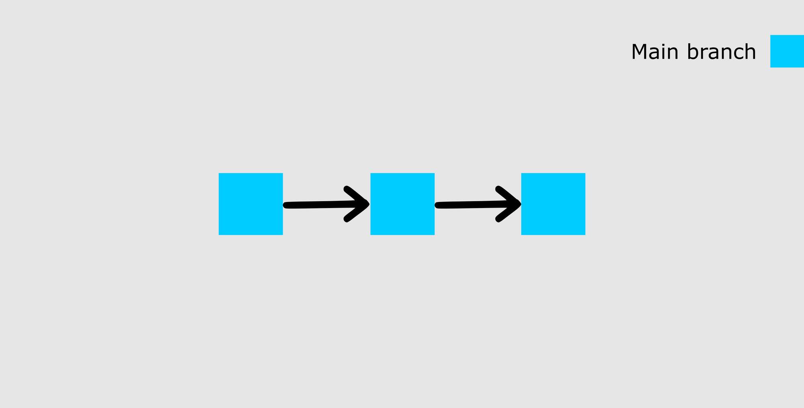
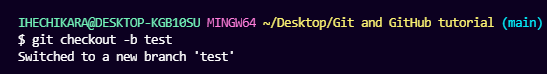
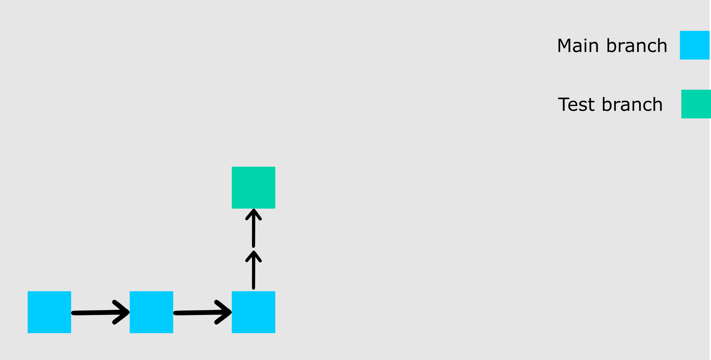
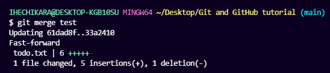
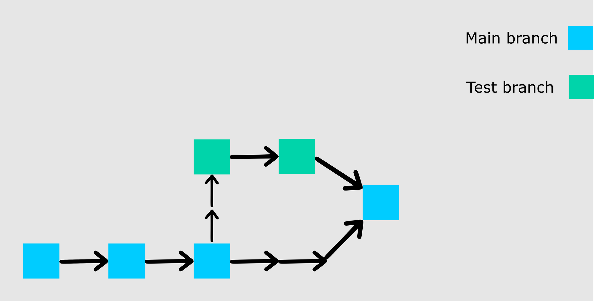

# Git / GitHub

鱼皮关于git与github的学习总结

https://mp.weixin.qq.com/s/MneTDYqwW9cgTKjOHmD-tA

Git 是目前 **最主流的** 分布式版本控制系统 ，版本控制系统可以帮你保存文件的所有修改记录、并使用 **版本号** 进行区分。你可以随时浏览历史版本、将改错的文件还原到指定的版本，还可以对比不同版本的文件差异、防止旧版本覆盖新版本等。起到恢复和保护作用。而 **分布式** 是指每位开发者都能在本地维护自己的代码和修改记录，并且还能和其他人的记录进行同步。

GtiHub 是主流的 `代码托管平台` ，可以理解为一个存放和管理代码的 “网盘”，大家可以把自己的代码传上去进行共享和维护，也可以从平台下载代码。

Git 是工具（是抓手），而 GitHub 是平台。两者没有必然的联系，我们也可以用其他工具来向 GitHub 提交代码，也可以用 Git 向其他平台提交代码。

## 1. Git

### 1.1Git基础

#### 1.1.1 

#### 1.1.2 分支（branch）

有了分支，你可以在不破坏原始副本的情况下，创建一个你想要处理的文件副本。你可以把这些修改合并到原始副本上，或者让分支保持独立。

在我们开始使用分支之前，我想给大家看一下我们的 repo 的可视化表示，它看起来像这样：



上图显示了我们的主分支和最近的两次提交（第一次提交和添加的新任务提交）。

在这一点上，我想在列表中添加更多的任务，但我还不确定是否要把它们放在主列表中。因此，我将创建一个名为 `test` 的新分支，看看加入更多任务后我的列表会是什么样子。

要创建一个新的分支，运行这个命令。`git checkout -b test`。我将把它分开来。

`checkout`告诉 Git 它应该切换到一个新的分支。`b`告诉 Git 创建一个新的分支。`test`是要创建和切换到的分支的名字。以下是你应该得到的响应：



```shell
git checkout -b
```

现在我们已经创建了一个新的分支，这就是我们的 repo 的样子：



```shell
git branch
```

我们从上次提交的状态中创建了新的分支。现在让我们为这个新分支添加更多任务。

```txt
MY TO-DO LIST

1. Write an article.
2. Code.
3. Study books.
4. Attend classes on time.
5. Visit aunt.
6. Apply for remote jobs. 
7. Practice code
8. Complete internship task.
9. Practice chess openings.
10. Solve chess puzzles.
11. Check exam schedule. 
```

我增加了四个新任务。要把新的状态合并到主分支（main branch）。你必须先把这个分支分阶段并提交，由于我们在上一节中做了两次，我就不详细介绍如何提交。

你应该自己试着做一下，这样你就会明白它是如何工作的。作为提示，先添加文件，然后带着信息提交（参考上一节的细节，告诉你如何做）。

提交完测试分支后，通过运行以下命令切换回主分支，`git checkout main`。

你是否注意到，我们没有添加`-b`？这是因为我们不是在创建一个新的分支，而是切换到一个现有的分支。你可以通过运行`git branch`命令来检查你的 repo 中存在的所有分支。

现在，我们可以通过运行`git merge test`，将测试分支中的修改合并到主分支中。这时，你会看到测试分支中的所有改动都反映在主分支中。你还应该收到类似这样的回复：



```shell
git merge
```

下面是我们的 repo 的图示：



如果你继续将你的 repo 推送到 GitHub，你会发现测试分支不会被推送。它只会保留在你的本地 repo 中。如果你想推送你的测试分支，可以用`git checkout test`切换到该分支，然后运行`git push -u origin test`。

### 1.2 Git安装

#### 1.2.1 git bash 

Git Bash 是 Microsoft Windows 的应用程序，允许开发人员在命令行界面中使用 Git。

Git Bash 是一个 Microsoft Windows 应用程序，具有 Git 命令行 shell 体验和实用程序，例如安全外壳协议 (SSH)、安全复制协议 (SCP)、CAT（连接命令）等。 Bash 是 Bourne Again Shell 的首字母缩写词，这是一个 GNU 项目 shell。 shell 用于通过执行命令与操作系统交互，Bash 是 Linux 和 macOS 上使用的默认 shell。 **注意：**有关基本 Git 功能的详细概述，请阅读我们的 Git 初学者指南。

Git Bash 在 Windows 上模拟 bash 环境，允许用户在 Windows 操作系统上使用 Bash shell 和大多数标准 Unix 命令。用户可以通过在 Git Bash 中运行命令来与存储库和 Git 元素进行交互。

#### 1.2.2 安装Git

为了使用 Git，你必须在你的电脑上安装它。要做到这一点，你可以在[官方网站](https://git-scm.com/downloads) 下载最新版本。你可以从给出的选项中下载适合你的操作系统。

你也可以用命令行来安装 Git，但由于每个操作系统的命令都不一样，我们将专注于更通用的方法。

### 1.3 Git指令

#### 1.3.1 与github交互流程

**1.初始化**

- git clone <git地址> ：就是下载项目，并且现在的项目是一个仓库。这与直接下载安装包是不同的。
- git init ：就是把文档初始化为一个仓库,注意是吧不是库的文件夹初始为仓库。

有一个可操作的仓库是一切指令的前提。上述两个指令都是形成一个仓库。

**2.本地添加**

- git add -A : 添加所有文件到暂存区。
- git add . :添加当前目录下所有文件到暂存区。
- git add about.txt ：添加当前目录下特定文件。

添加后文件存入暂存区

**3.本地提交**

提交暂存区的文件到仓库

- git commit -m "提交信息" ：把暂存区的文件提交到仓库，“xxx”是本次提交的名称。
- git log --stat ：查看提交的历史记录。

提交完成后文件就到了本地的仓库中。

**4.推送仓库到 GitHub**

推送本地仓库到GitHub中的仓库中

- git remote add origin https://github.com/ihechikara/git-and-github-tutorial.git
- git branch -M main
- git push -u origin main

第一个命令 `git remote add origin [https://github.com/ihechikara/git-and-github-tutorial.git](https://github.com/ihechikara/git-and-github-tutorial.git)`，在你的本地 repo 和 Github 上的远程 repo 之间建立连接。

第二个命令 `git branch -M main` 将主分支的名字改为 "main"。默认的分支可能被创建为 "master"，但 "main "是现在这个 repo 的标准名称。这里通常没有回应。改不改都行。

最后一个命令 `git push -u origin main` 将你的 repo 从本地设备推送到 GitHub。

**至此已经完成git与github的完整交互**

#### 1.3.2 操作分支

**1.建立一个新的分支**

- git checkout -b test ： 以当前分支为基础新建分支命名为test

git branch : 列举所有的分支
git checkout <branchname> : 单纯地切换到某个分支
git branch -D <branchname> : 删掉特定的分支

git merge <branchname> : 合并分支到主分支


## 2.GitHub使用

github：代码托管平台

### 2.1 GitHub官网使用

官网上常见的英文单词：

- repository（仓库）：就是存放项目的，建立了仓库就可以进行提交撤回等git的操作
- commit（提交）：提交项目修改
- branch（分支）：

### 2.2 结合vscode使用


### 2.3 资源查找

#### 2.3.1 一些好用的网站

• https://github.com/trending/
• https://github.com/521xueweihan/HelloGitHub
• https://github.com/ruanyf/weekly
• https://www.zhihu.com/column/mm-fe

#### 2.3.2 特殊查找资源的小技巧

搜罗一些查找是的小技巧，方便更加快速的找到最好的最适合的资源。

##### 2.3.2.1 常用的前缀后缀

- 找百科大全  awesome xxx
- 找例子 xxx sample
- 找空项目架子 xxx starter / xxx boilerplate
- 找教程 xxx tutorial 

##### 2.3.2.2 加一些限制词


